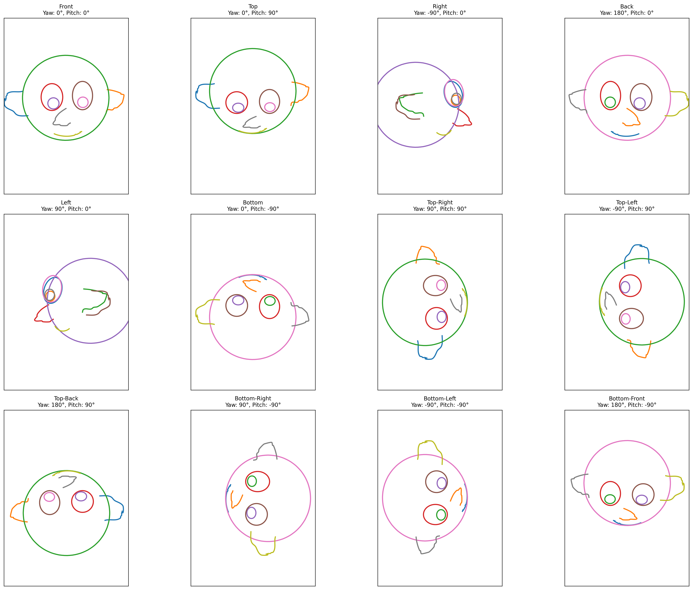
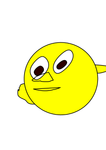

# 2.5D Cartoon Models (Reimplementation)

This repository is an attempt to reproduce the work:  

**[2.5D Cartoon Models](http://www.alecrivers.com/2.5dcartoonmodels/)**  
*Alec Rivers, Takeo Igarashi, Frédo Durand*  
SIGGRAPH 2010

---

## Overview
This reimplementation largely restores the original functionality of the paper (except for the UI).  
Implemented features include:
- **Parameterized Orientation Space**
- **Shape Interpolation**
- **Grouping**
- **3D Anchor Computation**

Some issues still remain in the results, which may be refined and optimized later.

---

## Installation

1. Create the conda environment:
   ```bash
   conda env create -f environment.yml

2. *(Optional)* Prepare your **input SVG files** in advance:

   * Edit the path in the demo file, e.g.:

     ```python
     parse_svg_file('data/yellow_head_right.svg')
     ```
   * You must provide **front, right, and top view SVGs** with body-part grouping.
   * Example format: [`data/yellow_head_front.svg`](data/yellow_head_front.svg).
   * I used **Inkscape** to draw these views, and grouped each body part’s strokes accordingly.

---

## Orientation Space Key Views

The **12 main key views** used in the parameterized orientation space can be found in:

📂 `orientation_space_views/`

Preview:



---

## Usage

### With Grouping

For grouped body parts, you must manually define groups according to your input.
Example (from `demo_v5_grouping.py`):

```python
model.create_group('eyes', ['rightEye', 'leftEye'])
model.create_group('earsFace', ['rightEar', 'leftEar', 'face'], 'head')
model.create_group('head', ['eyes', 'earsFace', 'nose', 'mouth'])
```

Run:

```bash
python demo_v5_grouping.py --yaw -30 --pitch 60
```

### Without Grouping

Run:

```bash
python demo_v5_no_grouping.py --yaw -30 --pitch 60
```

---

## Example Outputs

Here are some example visualizations generated by the model:

* **Key View (yaw=-90, pitch=90)**
  

* **Novel View (yaw=30, pitch=-30)**

  * With Grouping: 
  * Without Grouping: 

Depending on the input and view angle, the **grouping version** or **no-grouping version** may produce better results.
It is recommended to try both and compare the output.

---

## Acknowledgement

This work is based on:
**[2.5D Cartoon Models](http://www.alecrivers.com/2.5dcartoonmodels/)**, Alec Rivers, Takeo Igarashi, Frédo Durand. SIGGRAPH 2010.

